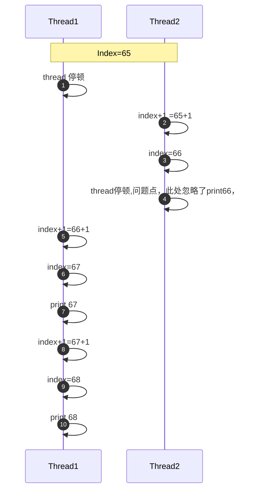
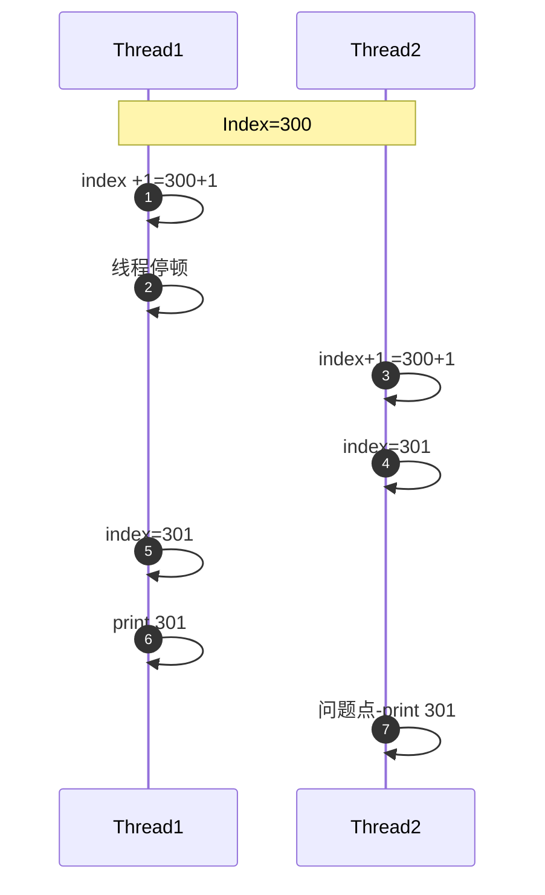
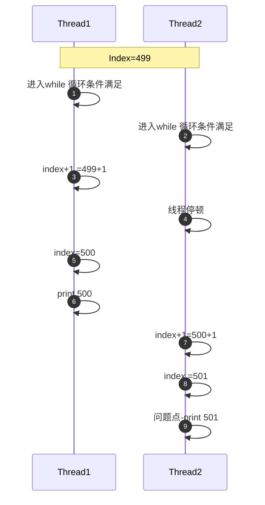

- 从字节码指令维度掌握 synchronized 关键字的原理,以及互斥同步的 流程
- 还有一点很重要的是,通过画时序图 分析数据不一致的场景 和原因

# 4.1数据同步(Todo)

### 共享资源: 

多个线程同时对同一份资源进行访问(读写操作),被多个线程访问的资源,**就称为共享资源**

### 数据同步

如何保证多个线程访问到的数据是一致的,则被称为**数据同步或者资源同步**

### 4.1.1 数据不一致问题的引入

```java
public class TicketWindownRunnableError implements Runnable {
    private int index = 1;

    private final static int MAX = 500;

    @Override
    public void run() {
        while (index <= MAX) {
            System.out.println(Thread.currentThread() + "的号码是：" + (index++));
        }
    }

    public static void main(String[] args) {
        final TicketWindownRunnableError task = new TicketWindownRunnableError();
        Thread 一号窗口 = new Thread(task, "一号窗口");
        Thread 二号窗口 = new Thread(task, "二号窗口");
        Thread 三号窗口 = new Thread(task, "三号窗口");
        Thread 四号窗口 = new Thread(task, "四号窗口");
        一号窗口.start();
        二号窗口.start();
        三号窗口.start();
        四号窗口.start();
 
    }
}


```

#### 问题现象

多次运行上面程序，会大致出现3类问题，具体如下：

- 某个号码被略过，没有出现
- 某个号码被多次显示
- 号码超过了最大值500

#### 问题分析


```java
    @Override
    public void run() {
        while (index <= MAX) {
            System.out.println(Thread.currentThread() + "的号码是：" + (index++));
        }
    }
```

##### 1. 号码被掠过

线程的执行是由CPU时间片轮询调度的，假设此时线程1.线程2 都执行到了index =65 的位置，其中线程2 将index 修改为66后未输出前，cpu调度将执行权力交给了线程1，线程1 将其累加到了 67， 那么66就被忽略了




##### 2. 号码重复出现

线程1 执行index+1，然后cpu 执行权落入线程2手里，由于线程1 并没有给index 赋值301， 所以线程2 执行index+1的 结果也是 301，

所以出现了 重复号码的情况



##### 3. 号码超过了最大值

当 index=499 的时候，线程1 和线程2 都看到条件满足。线程2短暂停顿，线程1 将index增加到了500，线程2恢复运行后，又将 500+1 ，此时就出现了超过MAX 的情况。


# 4.2 初始synchronized关键字

## 4.2.1 什么是synchronized

JDK官网对synchronized关键字的权威解释：

Synchronized keyword enable a simple strategy for preventing thread interference and memory consistency errors:  if an object is visible to more than one thread,all reads or writes to that object's  variables are done through synchronized methods.

Synchronized关键字启用了一种简单的策略来防止线程干扰和内存一致性错误:如果一个对象对多个线程可见，那么对该对象变量的所有读或写操作都通过Synchronized同步的方法完成。 

同步互斥： 互斥是方式，同步是结果

具体表现为：

- synchronized 关键字提供了一种锁机制，能够确保共享变量的互斥访问，从而防止数据不一致问题的出现
- synchronized 关键字包括 monitor enter 和 monitor exit 两个JVM 指令，它能够保证在任何时候任何线程执行到 monitor enter成功之前都必须从主内存获取数据，而不是从缓存中， 在monitor exit运行成功之后，共享变量被更新后的值 必须刷入回之内存 （简单来说，就是 执行 monitor enter之前，从主内存中获取共享变量的值，在执行 monitor exit之后，将更新后的共享变量的值 同步回主内存，解决缓存一致性的问题）
- synchronized 的指令严格遵守 java 的先行发生原则（happens-before），一个monitor exit 指令之前 一定由一个 monitor enter 指令，成对出现 。


## 4.2.2 synchronized 关键字的用法

synchronized 可以用于对 方法块 或者方法进行修饰， 不能够用于对class 或者变量进行修饰

### 1. 同步方法

同步方法的语法  ： [default | public | private | protected] **synchronized** [static ] type methods().

```java
public synchronized void sync(){
    。。。
}
public synchronized static void staticSync(){
    。。。
}

```

### 2. 同步代码块

```java
private final Object MUTEX=new Object();
public void sync(){
    synchronized(MUTEX){
        。。。
    }
    
}
```

## 4.3 深入理解synchronized关键字

- synchronized 提供了一种互斥机制，在同一时刻，只能由一个线程访问同步资源
- 不应该将MUTEX称为锁，严谨的说法，应该是 某线程 获取到了 MUTEX关联的 monitor锁

### Monitor enter

每个对象都与一个monitor 相关联，一个monitor的lock的锁 只能被一个线程在同一时间获得，在一个线程尝试获得与 对象关联monitor的所有权时候回发生如下几件事情。

- 如果monitor 的计数器为0，则意味着 该monitor的lock 还没有被获得，某个线程获得之后 将立即对该计数器加一 ，从此该线程就是这个monitor 的所有者了
- 如果一个已经拥有该monitor所有权的线程重入 ，则会导致 monitor计数器再次累加
- 如果monitor已经被其他线程 所拥有，则 其他线程尝试获取该monitor 的所有权时，会被陷入阻塞状态知道monitor计数器 变为0，才能再次尝试 获取对 monitor的所有权 。

### Monitor exit

- 释放对 monitor的所有权，想要释放对 某个对象关联的 monitor的所有权的前提是 ，你曾经获得了所有权。
- 释放monitor锁的过程比较简单，就是将 monitor的计数器减一， 
- 如果monitor的计数器 结果为0，那就意味着 该线程不再拥有对 该monitor的所有权，通俗的讲 就是解锁。
- 与此同时，被该 monitor block的线程将再次尝试 获得对该monitor的所有权

### 使用 synchronized需要注意的问题

- 与monitor关联的对象不能为空,  

```java
private final Object mutex=null;
public void syncMethod(){
    synchronized(mutex){
        、、、
    }
}
每一个对象和一个 monitor 关联，对象都为null了，monitor 肯定无从谈起
```

- synchronized作用域太大，synchronized 应该尽可能地只作用于  **共享资源地读写作用域**

```java
public static class Task implements Runnable{
    @Override
    public synchronized void run(){
        //
    } 
}
由于synchronized 关键字存在排他性，也就是所有线程必须串行的经过synchronized保护的共享区域，
    如果synchronized 作用域越大，则代表其效率越低，甚至丧失并发的优势
```

- 不同的monitor 企图锁相同的方法

  ```java
  public static class Task implements Runnable{
      private final Object mutex=new Object();
      @Override
      public synchronized void run(){
          //
           synchronized(mutex){
          、、、
     	 }
      } 
      
      public static void main(String[] args){
          for (int i=0;i<5;i++){
              new Thread(Task::new).start();
          }
      }
      
  }
  //构造了5个线程，同时也构造了5个 Runnable实例， Runnable作为逻辑单元传递给Thread，然后将发现：
  synchronized 无法同步互斥， 因为 线程之间的monitor lock争抢只能发生在 monitor 关联的同一个引用上。
  ```


- 多个锁的交叉导致死锁


### 4.4 This Monitor和Class Monitor 

#### This Monitor:

##### 问题：

synchronized 关键字修饰了同一个实例对象的两个不同方法，那么与之对应的monitor 是什么？ 两个 monitor是否一致呢。

实例锁

```java
public class ThisMonitor
{

    public synchronized void method1()
    {
        System.out.println(currentThread().getName() + " enter to method1");
        try
        {
            TimeUnit.MINUTES.sleep(10);
        } catch (InterruptedException e)
        {
            e.printStackTrace();
        }
    }

    public void method2()
    {
        synchronized (this)
        {
            System.out.println(currentThread().getName() + " enter to method2");
            try
            {
                TimeUnit.MINUTES.sleep(10);
            } catch (InterruptedException e)
            {
                e.printStackTrace();
            }
        }
    }

    public static void main(String[] args)
    {
        ThisMonitor thisMonitor = new ThisMonitor();
        new Thread(thisMonitor::method1, "T1").start();
        new Thread(thisMonitor::method2, "T2").start();
    }
}

```


#### 结论： 

- 由上图可以看出 T1获取了 monitor lock  并处于休眠状态，而 T2 线程企图获取 monitor 的lock时陷入了 BLOCKED 状态，可见 使用synchronized 关键字同步类的不同实例方法，争抢的时 同一个monitor的lock ，而 与之关联的引用则是 ThisMonitor 的实例引用
- 其中 method1 保持方法同步的方式，method2 则采用了同步代码块 的方式，并且使用的是 this的monitor

when a thread invokes a synchronized method, it automatically acquires the intrinsic lock  for that method's object and releases it when the method returns .  The lock release occurs even if the return was caused by an uncaught exception .


#### Class Monitor:

对象锁，static修饰 ,有两个类方法（静态方法）分别使用 synchronized对其进行同步

```java
public class ClassMonitor
{
    public static synchronized void method1()
    {
        System.out.println(currentThread().getName() + " enter to method1");
        try
        {
            TimeUnit.MINUTES.sleep(10);
        } catch (InterruptedException e)
        {
            e.printStackTrace();
        }
    }
    public static void method2()
    {
        synchronized (ClassMonitor.class)
        {
            System.out.println(currentThread().getName() + " enter to method2");
            try
            {
                TimeUnit.MINUTES.sleep(10);
            } catch (InterruptedException e)
            {
                e.printStackTrace();
            }
        }
    }
    public static void main(String[] args)
    {
        new Thread(ClassMonitor::method1, "T1").start();
        new Thread(ClassMonitor::method2, "T2").start();
    }
}
```


-  从上图可以看出 用synchronized 同步某个类的不同静态方法争抢的也是 同一个 monitor的lock ，
- 与 This monitor 信息不一样的地方在于 （a java.lang.Class for ........）
- 由此推断与 该 monitor关联的引用是 ClassMonitor.class  实例


since  a static method is associated with a class, not an object  . In this case, the thread acquires the intrinstic lock for the Class  object associated with the class . Thus access to class's static fields is controlled by a lock that's distinct from the lock for any instance of the class .


### 4.5 程序死锁的原因以及如何诊断

1. 交叉锁可导致程序出现死锁

   典型的哲学家吃面问题，

2. 内存不足

   当并发请求系统可用内存时，如果此时系统内存不足，则可能会出现死锁的情况，举个例子，两个线程 T1 和 T2，执行某个任务，其中T1 已经获取了10MB内存， T2 获取了20MB内存，如果每个线程都需要30MB的内存，但是剩余可用内存刚好为20MB，那么两个线程 有可能都在等待彼此能够释放内存资源。

3. 一问一答式的数据交换

4. 数据库锁

   无论是数据库表级别的锁，还是行级别的锁， 比如 某个线程执行 for update语句退出了事务，其他线程访问该数据库时 都将陷入死锁。

5. 文件锁

   某线程获得了文件锁意外退出，其他读取该文件的线程也将会 进入死锁知道系统释放文件句柄资源

6. 死循环引起的死锁

#### 死锁诊断

1. 交叉锁引起的死锁

- 打开jstack 工具或者 jconsole工具，一般交叉锁引起的死锁线程都会进入 BLOCKED状态，CPU资源占用不高，很容易借助工具来发现


2. 死循环引起的死锁（假死）

- 工作的线程并未BLOCKED ,而是始终处于 RUNNABLE状态，CPU使用率高居不下，


## 总结：

- synchronized 关键字在Java 中提供了同步语义，它可以保证在同一时间 只允许一个线程访问 共享数据资源。
- 本章介绍了synchronized的详细用法，修饰 方法，或者修饰代码块，
  - 如果修饰的是  static 方法或者static 方法快，那么 使用的就是 CLASS monitor，是 class 实例的monitor
  - 如果修饰的不带static ，那就是 this monitor，使用的是某个对象的 monitor

- 介绍死锁场景，以及定位死锁问题