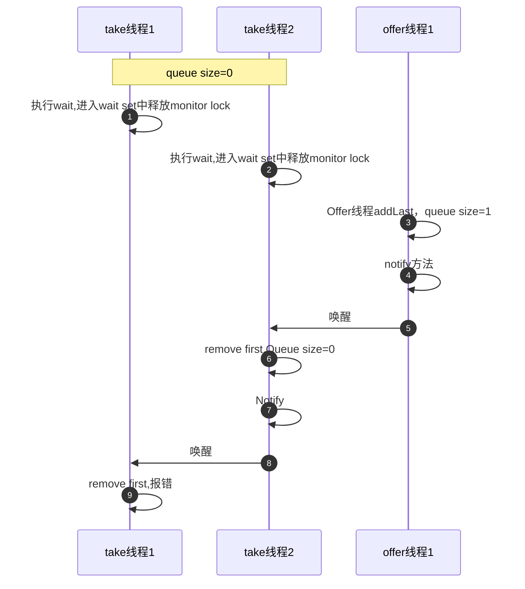
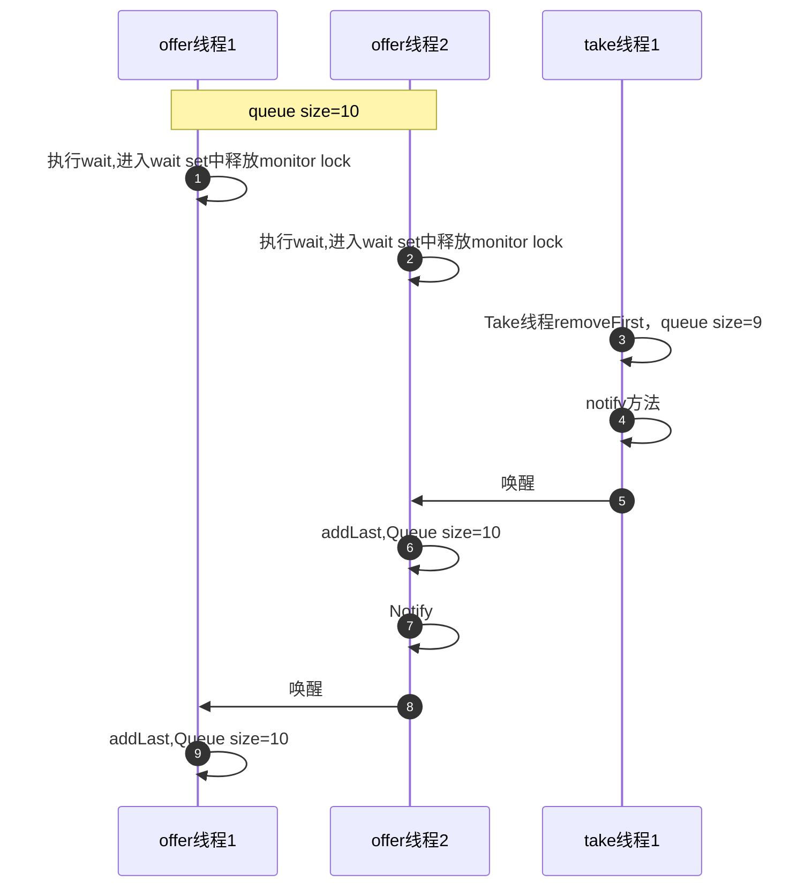

- 线程间通信又称为 进程内通信，多个线程实现互斥访问共享资源时 会互相发送信号或等待信号
- 主要是 线程之间 wait，notify，notifyAll ，以及背后的原理内幕

- wait 和 notify 方法必须拥有该对象的monitor ，也就是wait方法必须在同步方法中使用**

# 同步阻塞与异步非阻塞

```java
public class EventQueue {

    private final int max;

    static class Event {
    }
    private final LinkedList<Event> eventQueue = new LinkedList<>();
    private final static int DEFAULT_MAX_EVENT = 10;
    public EventQueue() {
        this(DEFAULT_MAX_EVENT);
    }
    public EventQueue(int max) {
        this.max = max;
    }
    public void offer(Event event) {
        synchronized (eventQueue) {
            if (eventQueue.size() >= max) {
                try {
                    console(" the queue is full.");
                    eventQueue.wait();
                } catch (InterruptedException e) {
                    e.printStackTrace();
                }
            }
            console(" the new event is submitted");
            eventQueue.addLast(event);
            // 只能唤醒一个 线程
            eventQueue.notify();
        }
    }

    public Event take() {
        synchronized (eventQueue) {
            if (eventQueue.isEmpty()) {
                try {
                    console(" the queue is empty.");
                    eventQueue.wait();
                } catch (InterruptedException e) {
                    e.printStackTrace();
                }
            }
            Event event = eventQueue.removeFirst();
            this.eventQueue.notify();
            console(" the event " + event + " is handled.");
            return event;
        }
    }

    private void console(String message) {
        System.out.printf("%s:%s\n", currentThread().getName(), message);
    }
}

```


## 同步阻塞消息处理

- 同步Event 提交，客户端等待时间过长 会陷入阻塞，导致二次提交 Event耗时过长
- 由于客户端提交的Event数量不多，导致系统同时受理业务数量有限，也就是系统的整理的吞吐量不高
- 这种一个线程处理一个Event的方式，会导致出现频繁的创建开启和销毁，从而增加系统额外开销
- 在业务达到峰值的时候，大量的业务处理线程阻塞会导致频繁的CPU切换上下文，从而降低系统性能


## 异步非阻塞消息处理

- 客户端不用等到结果处理结束之后才能返回，从而提高了系统的吞吐量和并发量
- 服务端的线程数量在一个可控的范围之内是不会导致太多的CPU上下文切换，从而带来额外的开销
- 服务端线程可以重复利用，这样可以减少不断创建线程带来的资源浪费


# 单线程间通信

## wait和notify

### wait

- wait 和 notify是 Object中的方法，也就是说 JDK中的每一个类都拥有这2个方法

- 下面是 wait的 3个重载方法

```java
// 1.
public final void wait(long timeout, int nanos) throws InterruptedException {
        if (timeout < 0) {
            throw new IllegalArgumentException("timeout value is negative");
        }

        if (nanos < 0 || nanos > 999999) {
            throw new IllegalArgumentException(
                                "nanosecond timeout value out of range");
        }

        if (nanos >= 500000 || (nanos != 0 && timeout == 0)) {
            timeout++;
        }

        wait(timeout);
    }
// 2. 
    public final void wait() throws InterruptedException {
        wait(0);
    }
// 3.
    public final native void wait(long timeout) throws InterruptedException;
```

- wait 方法的3个重载方法都将调用wait（long timeout）这个方法，
- wait（）等价于 wait（0），其中0代表永不超时 
- Object的wait（long timeout）方法会导致当前线程进入阻塞，直到 有其他线程调用了 Object的notify 或者 notifyAll方法才能将其唤醒，或者 阻塞时间到达了 timeout时间而自动唤醒
- **wait方法必须拥有该对象的monitor ，也就是wait方法必须在同步方法中使用**
- **当前线程执行了该对象的wait方法之后，将会放弃对该 monitor的所有权并且进入与该对象关联的waitset中，也就说一旦线程执行了某个object 的wait方法之后，他就会释放对该对象 monitor的所有权，**其他线程也会有机会继续争抢该 monitor的所有权 
- （这个就是 Thread:: join的背后的逻辑，thread.join就是调用了wait 方法，所以父线程会 等到子线程执行完毕，才继续执行）


### notify

```java
 /**
     * Wakes up a single thread that is waiting on this object's
     * monitor. If any threads are waiting on this object, one of them
     * is chosen to be awakened. The choice is arbitrary and occurs at
     * the discretion of the implementation. A thread waits on an object's
     * monitor by calling one of the {@code wait} methods.
     * <p>
     * The awakened thread will not be able to proceed until the current
     * thread relinquishes the lock on this object. The awakened thread will
     * compete in the usual manner with any other threads that might be
     * actively competing to synchronize on this object; for example, the
     * awakened thread enjoys no reliable privilege or disadvantage in being
     * the next thread to lock this object.
     * <p>
     * This method should only be called by a thread that is the owner
     * of this object's monitor. A thread becomes the owner of the
     * object's monitor in one of three ways:
     * <ul>
     * <li>By executing a synchronized instance method of that object.
     * <li>By executing the body of a {@code synchronized} statement
     *     that synchronizes on the object.
     * <li>For objects of type {@code Class,} by executing a
     *     synchronized static method of that class.
     * </ul>
     * <p>
     * Only one thread at a time can own an object's monitor.
     *
     * @throws  IllegalMonitorStateException  if the current thread is not
     *               the owner of this object's monitor.
     * @see        java.lang.Object#notifyAll()
     * @see        java.lang.Object#wait()
     */
    public final native void notify();
```

看一下方法说明注释-

- 唤醒**单个**正在等待执行该对象wait 方法的线程
- 如果有很多线程都在等待，其中之一会被选中唤醒， 选择是任意的
- 被唤醒的线程需要重新获取对该对象所关联 monitor的lock 才能继续执行

- 被唤醒的线程将不能继续，直到当前线程放弃对该对象的锁。被唤醒的线程将以通常的方式与任何其他可能正在主动竞争同步这个对象的线程竞争;例如，被唤醒的线程在成为下一个锁定该对象的线程时没有任何可靠的特权或劣势

###  关于wait 和notify的注意事项

- **wait 是可中断方法**，所以： 当前线程一旦调用了wait方法 进入阻塞状态，其他线程是可以使用 interrupt 方法将其打断的； 可中断方法被打断后，会收到 中断异常 InterruptedException ，同时 interrupt flag 也会被擦除 

- 线程执行了某个对象的wait 方法之后，会加入与之 对应的wait set中，**每一个对象的 monitor 都有一个与之关联的 wait set**
- **当线程进入wait set之后，notify 方法可以将其唤醒**，也就是 从 wait set中弹出，**同时中断 wait 中的线程也会将其唤醒**
- **必须在同步方法中 使用 wait 和 notify 方法，** 因为执行wait 和 notify 的前提条件是  必须持有同步方法的monitor 的所有权， 运行下面任何一个方法 都会抛出 非法的 monitor 状态异常  InllegalMonitorStateException: 

```java
// 报错，因为 **必须在同步方法中 使用 wait 和 notify 方法，**
private void testwait(){
    try{
      this.wait();  
    }catch(InterruptedException e){
        e.printStackTrace();
    }
}

// 报错，**必须在同步方法中 使用 wait 和 notify 方法，**
private void testwait(){
    this.notify();
}
```

- 同步代码的monitor 必须与执行  wait  notify方法的对象一致，简单来说就是 **用哪个对象的 monitor 进行同步，就只能用哪个对象 进行wait 和 notify操作。**

运行下面代码的任何一个方法会报错：

```java
public class WaitNotify
{

    private final Object MUTEX = new Object();

    // 报错，如果非要用 MUTEx ，可以使用同步代码块的形式 
    private synchronized void testWait()
    {
        try
        {
            MUTEX.wait();
        } catch (InterruptedException e)
        {
            e.printStackTrace();
        }
    }
    // 报错，报错，如果非要用 MUTEx ，可以使用同步代码块的形式 
    private synchronized void testNotify()
    {
        MUTEX.notifyAll();
    }

    public static void main(String[] args)
    {
        WaitNotify waitNotify = new WaitNotify();
        waitNotify.testNotify();
    }
}

运行结果：

Exception in thread "main" java.lang.IllegalMonitorStateException
	at java.lang.Object.notifyAll(Native Method)
	at com.wangwenjun.concurrent.chapter05.WaitNotify.testNotify(WaitNotify.java:21)
	at com.wangwenjun.concurrent.chapter05.WaitNotify.main(WaitNotify.java:27)

```

上面同步方法中 monitor 引用的是 this，而wait notify 使用的确实  MUTEX，**虽然是在 同步方法中执行 wait  notify方法，但是 wait 和 notify方法的执行并未 获取 MUTEX 的monitor 为前提**


## wait 和sleep

- 都可以使线程进入 阻塞状态
- 都是可中断方法，被中断后会收到中断异常
- wait 时 Object方法， sleep 是 THread  方法
- wait 执行需要在 synchronized 方法中进行，而sleep 不需要
- **线程在同步方法中执行sleep 方法时，不会释放 monitor锁 ， 而 wait 方法则会释放monitor 锁**
- sleep 方法短暂休眠后会主动退出阻塞 ，而 wait方法（没有指定时间） 则需要被其他线程中断才能退出阻塞 


# 多线程通信

- 前面之所以 把 notify划到  单线程通信，我觉得是 因为 notify 只能唤醒一个线程，所以叫单线程通信
- 而 notifyAll 可以唤醒所以 waitset中的线程，所以称为 多线程通信


## 生产者消费者

### 1.notifyAll 方法

- 多线程之间通信需要用到Object 的notifyAll 方法，该方法与notify类似，都可以唤醒 由于调用wait方法而阻塞的线程，
- 但是 notify方法只能唤醒其中的一个线程，而notifyALL方法则可以同时唤醒全部的阻塞线程，同样被唤醒的线程仍需要继续争抢monitor的锁

```java
    /**
     * Wakes up all threads that are waiting on this object's monitor. A
     * thread waits on an object's monitor by calling one of the
     * {@code wait} methods.
     * <p>
     * The awakened threads will not be able to proceed until the current
     * thread relinquishes the lock on this object. The awakened threads
     * will compete in the usual manner with any other threads that might
     * be actively competing to synchronize on this object; for example,
     * the awakened threads enjoy no reliable privilege or disadvantage in
     * being the next thread to lock this object.
     * <p>
     * This method should only be called by a thread that is the owner
     * of this object's monitor. See the {@code notify} method for a
     * description of the ways in which a thread can become the owner of
     * a monitor.
     *
     * @throws  IllegalMonitorStateException  if the current thread is not
     *               the owner of this object's monitor.
     * @see        java.lang.Object#notify()
     * @see        java.lang.Object#wait()
     */
    public final native void notifyAll();
```

### 2.生产者消费者


前面的EventQueue 队列在多个线程同时并发的情况下会出现数据不一致的情况。当线程的数量增加的时候，会出现数据不一致的情况。

```java
public class EventClient
{

    public static void main(String[] args)
    {
        final EventQueue eventQueue = new EventQueue();
        for (int i = 0; i < 1; i++)
            new Thread(() ->
            {
                for (; ; )
                {
                    eventQueue.offer(new EventQueue.Event());
                }
            }, "Producer").start();

        for (int i = 0; i < 3; i++)
            new Thread(() ->
            {
                for (; ; )
                {
                    eventQueue.take();
                    try
                    {
                        TimeUnit.MILLISECONDS.sleep(10);
                    } catch (InterruptedException e)
                    {
                        e.printStackTrace();
                    }
                }
            }, "Consumer").start();

    }
}

Consumer: the queue is empty.
Exception in thread "Consumer" Exception in thread "Consumer" Exception in thread "Consumer" Exception in thread "Consumer" Exception in thread "Consumer" Exception in thread "Consumer" Exception in thread "Consumer" Exception in thread "Consumer" Exception in thread "Consumer" Exception in thread "Consumer" Exception in thread "Consumer" Exception in thread "Consumer" Exception in thread "Consumer" Exception in thread "Consumer" Exception in thread "Consumer" Exception in thread "Consumer" Exception in thread "Consumer" Exception in thread "Consumer" Exception in thread "Consumer" Exception in thread "Consumer" java.util.NoSuchElementException
	at java.util.LinkedList.removeFirst(LinkedList.java:270)
	at com.wangwenjun.concurrent.chapter05.EventQueue.take(EventQueue.java:48)
	at com.wangwenjun.concurrent.chapter05.EventClient.lambda$main$1(EventClient.java:25)
	at com.wangwenjun.concurrent.chapter05.EventClient$$Lambda$2/1324119927.run(Unknown Source)
	at java.lang.Thread.run(Thread.java:745)
```

数据不一致的情况大致分为2类，

- 其一是 LinLinkedList 中没有元素的时候，依旧调用了 removeFirst方法，
- 其二是 当LinkedList中的元素超过了10个的时候 仍旧执行了addLast方法

分析现象：

#### LinLinkedList 为空时，执行removeFirst方法

假设EventQueue中元素为空，

- 两个线程在执行take方法时分别调用wait 进入阻塞，另外一个offer线程执行addLast方法之后唤醒了其中一个阻塞的take线程，
- 该take线程顺利消费了一个元素之后，因为是 使用notify方法，只能唤醒一个线程，而此时恰巧再次唤醒了一个take线程，此时就会导致执行empty LinkedList的 removeFirst方法，过程如下：



#### LinLinkedList 元素为10时执行addLast方法




#### 解决方法： 

**只需要将临界值的if判断更改为while ，将 notify更改为 notifyAll即可**

```java
public class EventQueue {

    private final int max;

    static class Event {
    }
    private final LinkedList<Event> eventQueue = new LinkedList<>();
    private final static int DEFAULT_MAX_EVENT = 10;
    public EventQueue() {
        this(DEFAULT_MAX_EVENT);
    }
    public EventQueue(int max) {
        this.max = max;
    }
    public void offer(Event event) {
        synchronized (eventQueue) {
            while (eventQueue.size() >= max) {
                try {
                    console(" the queue is full.");
                    eventQueue.wait();
                } catch (InterruptedException e) {
                    e.printStackTrace();
                }
            }
            console(" the new event is submitted");
            eventQueue.addLast(event);
            // 唤醒所有线程，让他们再去争抢 monitor
            eventQueue.notifyAll();
        }
    }

    public Event take() {
        synchronized (eventQueue) {
            while (eventQueue.isEmpty()) {
                try {
                    console(" the queue is empty.");
                    eventQueue.wait();
                } catch (InterruptedException e) {
                    e.printStackTrace();
                }
            }
            Event event = eventQueue.removeFirst();
            // 唤醒所有线程，让他们再去争抢 monitor
            this.eventQueue.notifyAll();
            console(" the event " + event + " is handled.");
            return event;
        }
    }

    private void console(String message) {
        System.out.printf("%s:%s\n", currentThread().getName(), message);
    }
}
```

### 线程休息室wait set

- 在虚拟机规范中存在一个 wait set（线程休息室）的概念，至于 wait set时怎么样的数据结构，JDK官网并没有给出明确的定义，不同厂家的JDK有着不同的实现方式。
- 不管怎样，线程调用了某个对象的wait方法之后，都会加入与该对象monitor关联的wait set中，并且释放 monitor的所有权

下图演示了 ： 若干个线程调用了 wait方法之后被加入与 monitor关联的wait set中，待 另外一个线程（当前monitor持有者）调用该monitor的 notify方法之后，其中一个线程会从 wait set中弹出 。至于时随机弹出 还是先进先出的方式弹出，虚拟机同样没有给出强制要求 


而执行notifyAll 则不需要考虑哪个线程会被弹出，因为wait set中的所有wait线程都会被弹出，如下图5-6 所示


## 自定义显示锁BooleanLock

### synchronized关键字的缺陷

synchronized关键字 提供了一种排他式的数据同步机制，某个线程在获取 monitor lock的时候可能会被阻塞，而这种阻塞有2个很明显的缺陷：

- 无法控制阻塞时长
- 阻塞不可被中断

```java
public class SynchronizedDefect {

    public synchronized void syncMethod() {
        try {
            TimeUnit.HOURS.sleep(1);
        } catch (InterruptedException e) {
            e.printStackTrace();
        }
    }

    public static void main(String[] args) throws InterruptedException {
        SynchronizedDefect defect = new SynchronizedDefect();
        Thread t1 = new Thread(defect::syncMethod, "T1");
        //make sure the t1 started.
        t1.start();
        TimeUnit.MILLISECONDS.sleep(2);

        Thread t2 = new Thread(defect::syncMethod, "T2");
        t2.start();
        //make sure the t2 started.
        TimeUnit.MILLISECONDS.sleep(2);
        t2.interrupt();
        System.out.println(t2.isInterrupted());
        System.out.println(t2.getState());
    }
}
```


- 被 synchronized 同步的线程不可被中断

### 自定义显示锁BooleanLock

利用前面所学的知识，构造一个显示的BooleanLock，使其

- 具备synchronized关键字所有功能的同时，
- 又具备**可中断 和lock超时的功能**

```java
public interface Lock {
    /**
     * 永远阻塞，除非获取到了锁，这一点与synchronized类似，
     * 但是该方法可以被中断，中断时会抛出 InterruptedException
     * @throws InterruptedException
     */
    void lock() throws InterruptedException;

    /**
     * 除了被中断外，还增加了 对应的超时功能
     * @param mills
     * @throws InterruptedException
     * @throws TimeoutException
     */
    void lock(long mills) throws InterruptedException, TimeoutException;

    /**
     * 进行锁的释放
     */
    void unlock();

    /**
     * 获取当前有哪些线程被 阻塞，类是与 wait set
     * @return
     */
    List<Thread> getBlockedThreads();

    /**
     * true； 锁空闲
     * false：当前锁不可用，（锁被其他线程占领 && 或者自己已经拥有锁（这次就不让锁重入了） ）
     * 该方式 只是去判断锁的状态，不会真正的去 lock 或者 unlock，也就是不会修改锁状态
     *
     * @return
     */
    boolean tryLock();

}
```

#### 实现BooleanLock

```java
public class BooleanLock implements Lock {
    // 当前拥有锁的线程
    private Thread currentThread;
    /**
     * false ：当前锁没有被任何线程 获得，或者已经释放
     * true： 该锁已经被某个线程获得，该线程就是 currThread
     */
    private boolean locked = false;
    /**
     * 存储因为获取锁 而阻塞的线程
     */
    private final List<Thread> blockedList = new ArrayList<>();

 @Override
    public void lock() throws InterruptedException {
        synchronized (this) {
            while (locked) {
                //暂存当前线程
                final Thread tempThread = currentThread();
                // 装载 因获取锁而阻塞的 其他线程
                try {
                    if (!blockedList.contains(currentThread()))
                        blockedList.add(currentThread());
                    this.wait();
                } catch (InterruptedException e) {
                    // 如果当前线程在wait时候被中断，则从blockedList中删除，避免内存泄漏
                    blockedList.remove(tempThread);
                    //继续抛出异常
                    throw e;
                }
            }
            // 释放自己
            blockedList.remove(currentThread());
            // 上锁
            this.locked = true;
            //更新当前拥有锁的对象
            this.currentThread = currentThread();
        }
    }

    @Override
    public void lock(long mills) throws InterruptedException, TimeoutException {
        synchronized (this) {
            //1. 如果 mills（超时时间）不合法，抛异常
            if (mills < 0) {
                throw new InvalidParameterException("非法的mills参数");
            } else if (mills == 0) {
                this.lock();
            } else {
                long remainingMills = mills;
                long endMills = currentTimeMillis() + remainingMills;
                while (locked) {
                    //2. 如果剩余等待时间（remainingMills），小于等于0，意味着已经超时了，应该抛出 超时的异常
                    if (remainingMills <= 0)
                        throw new TimeoutException("can not get the lock during " + mills + " ms.");
                    if (!blockedList.contains(currentThread()))
                        blockedList.add(currentThread());
                    // 3. 多次wait的过程中，剩余等待时间（remainingMills）也会不断地更新
                    this.wait(remainingMills);
                    // 4. 刷新 remainingMills
                    remainingMills = endMills - currentTimeMillis();
                }
                // 5. 获得 monitor lock，从blockList中删除当前线程，修改locked 标识，且更新当前线程为 锁地拥有者
                blockedList.remove(currentThread());
                this.locked = true;
                this.currentThread = currentThread();
            }
        }
    }

    @Override
    public void unlock() {
        synchronized (this) {
            //1.只有锁地拥有者，才有资格释放锁
            if (currentThread == currentThread()) {
                // 2. 更新lock 标识为 未锁定
                this.locked = false;
                Optional.of(currentThread().getName() + " release the lock monitor.").ifPresent(System.out::println);
                //3. 清空wait set,通知wait set中所有线程，可以尝试抢锁了
                this.notifyAll();
            }
        }
    }

    @Override
    public List<Thread> getBlockedThreads() {
        return Collections.unmodifiableList(blockedList);
    }

    @Override
    public boolean tryLock() {
        synchronized (this) {
//            // 如果当前 lock 标识为已锁定 并且 自己不是锁的拥有者
//            if (locked && !this.currentThread.equals(currentThread())) {
//                //直接返回，也不 加入blockList
//                System.out.println("tryLock fail，当前Lock拥有者是:" + this.currentThread.getName());
//                return false;
//            }
//            //说明当前锁 空闲或者自己已经是锁的拥有者，
//            System.out.println("说明当前锁 空闲或者自己已经是锁的拥有者");
//            return true;
            //如果当前锁空闲，则返回true
            if (!locked) {
                //直接返回false，也不 加入blockList
                System.out.println("tryLock succ,当前锁空闲");
                return true;
            }
            System.out.println("tryLock fail，当前Lock拥有者是:" + this.currentThread.getName());
            return false;
        }
    }
}
```

#### 测试类：(tryLock是自己加上的，也可以去除)

```java
public class BooleanLockTest
{

    private final Lock lock = new BooleanLock();

    public void syncMethod()
    {
        try
        {
            //如果尝试获取锁失败，则直接返回
            if(!lock.tryLock()){
                System.out.println("当前线程tryLock失败,退出");
                return;
            }
            lock.lock();
            System.out.println(currentThread() + " get the lock.");
            int randomInt = current().nextInt(10);
            TimeUnit.SECONDS.sleep(randomInt);
        } catch (InterruptedException e)
        {
            e.printStackTrace();
        } finally
        {
            lock.unlock();
        }
    }

    public void syncMethodTimeoutable()
    {
        try
        {
            //如果尝试获取锁失败，则直接返回
            if(!lock.tryLock()){
                System.out.println("当前线程tryLock失败,退出");
                return;
            }
            lock.lock(1000);
            System.out.println(currentThread() + " get the lock.");
            int randomInt = current().nextInt(10);
            TimeUnit.SECONDS.sleep(randomInt);
        } catch (InterruptedException | TimeoutException e)
        {
            e.printStackTrace();
        } finally
        {
            lock.unlock();
        }
    }

    public static void main(String[] args) throws InterruptedException
    {
        BooleanLockTest blt = new BooleanLockTest();


        new Thread(blt::syncMethod, "T1").start();
        TimeUnit.MILLISECONDS.sleep(2);

        Thread t2 = new Thread(blt::syncMethodTimeoutable, "T2");
        t2.start();
        TimeUnit.MILLISECONDS.sleep(10);

        /*(BooleanLockTest blt = new BooleanLockTest();
        IntStream.range(0, 2)
                .mapToObj(i -> new Thread(blt::syncMethod,"Thread"+i))
                .forEach(Thread::start);*/
    }
```


# 总结：

- 介绍了wait 和notify方法的使用，以及注意事项，比如：
  - wait 和notify方法必须在同步方法中使用，且当前线程必须拥有锁，才可以
  - 同步代码的monitor 必须与执行  wait  notify方法的对象一致，简单来说就是 **用哪个对象的 monitor 进行同步，就只能用哪个对象 进行wait 和 notify操作。**
  - 不能使用空对象（null）作为 monitor

- 生产者与消费者模型是多线程开发最常用的模型之一，也是多线程间 通信的最好范例
- 讲诉了wait set线程休息室的概念，以及调用notify 和 notifyAll 对wait set的影响
- synchronized同步方法的缺点：
  - 不可以中断
  - 无法超时
- 通过synchronized的缺点，只定义开发了一个BooleanLock锁，其功能包括：
  - synchronized关键字的互斥访问 共享资源
  - 增加了可中断功能
  - 增加了 可超时功能
  - 增加了 tryLock功能