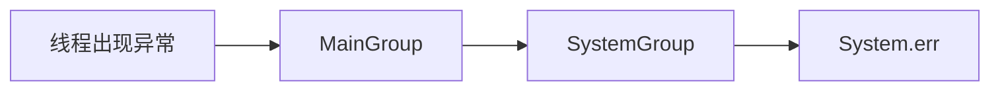
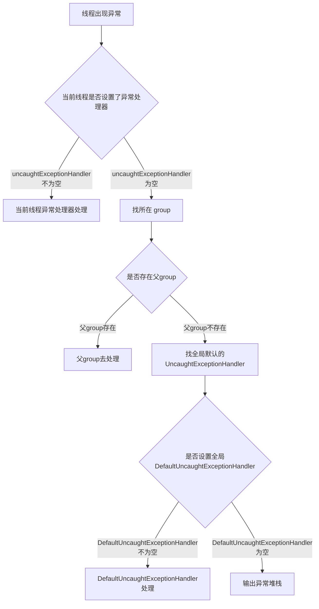

- 学习如何获取线程在运行时期的异常信息
- 学习如何向Java程序注入 Hook线程

# 获取线程运行时异常

在Thread类中，关于处理运行时异常的API总共有4个，如下所示：

```java
// 1.  为某个特定线程 指定 UncaughtExceptionHandler
public static void setDefaultUncaughtExceptionHandler(UncaughtExceptionHandler eh) {
        SecurityManager sm = System.getSecurityManager();
        if (sm != null) {
            sm.checkPermission(
                new RuntimePermission("setDefaultUncaughtExceptionHandler")
                    );
        }

         defaultUncaughtExceptionHandler = eh;
     }
//2. 设置全局的 UncaughtExceptionHandler
 public static UncaughtExceptionHandler getDefaultUncaughtExceptionHandler(){
        return defaultUncaughtExceptionHandler;
    }
//3.  获取特定线程的 UncaughtExceptionHandler
    public UncaughtExceptionHandler getUncaughtExceptionHandler() {
        return uncaughtExceptionHandler != null ?
            uncaughtExceptionHandler : group;
    }
//4.  获取全局的 UncaughtExceptionHandler
    public void setUncaughtExceptionHandler(UncaughtExceptionHandler eh) {
        checkAccess();
        uncaughtExceptionHandler = eh;
    }
```

## UncaughtExceptionHandler的介绍

- 线程在执行单元中时不允许抛出checked异常的
- 线程运行在自己的上下文中，派生它的线程将无法直接获得它运行中出现的异常信息

所以Java为我们提供了一个 UncaughtExceptionHandler 接口，

- 当线程在运行过程中出现了异常时，会回调UncaughtExceptionHandler 接口，从而我们得知 哪个线程在运行时出错，以及错误类型


```java

 /**
     * Interface for handlers invoked when a <tt>Thread</tt> abruptly
     * terminates due to an uncaught exception.
     （当一个线程突然的终结了由于一个未被捕获的异常，这个时候这个handler会被调用 ）
     * <p>When a thread is about to terminate due to an uncaught exception
     * the Java Virtual Machine will query the thread for its
     * <tt>UncaughtExceptionHandler</tt> using
     * {@link #getUncaughtExceptionHandler} and will invoke the handler's
     * <tt>uncaughtException</tt> method, passing the thread and the
     * exception as arguments.
     （当线程由于未捕获的异常即将终止时，Java虚拟机将查询它的线程 为了给 UncaughtExceptionHandler做参数，JVM 传递线程和
*异常作为参数给 uncaughtException方法）
     * If a thread has not had its <tt>UncaughtExceptionHandler</tt>
     * explicitly set, then its <tt>ThreadGroup</tt> object acts as its
     * <tt>UncaughtExceptionHandler</tt>. If the <tt>ThreadGroup</tt> object
     * has no
     * special requirements for dealing with the exception, it can forward
     * the invocation to the {@linkplain #getDefaultUncaughtExceptionHandler
     * default uncaught exception handler}.
     *
     * @see #setDefaultUncaughtExceptionHandler
     * @see #setUncaughtExceptionHandler
     * @see ThreadGroup#uncaughtException
     * @since 1.5
     */
    @FunctionalInterface
    public interface UncaughtExceptionHandler {
        /**
         * Method invoked when the given thread terminates due to the
         * given uncaught exception.
         * <p>Any exception thrown by this method will be ignored by the
         * Java Virtual Machine.
         * @param t the thread
         * @param e the exception
         */
        void uncaughtException(Thread t, Throwable e);
    }
```

- 该回调接口会被Thread 中的dispatchUncaughtException方法调用，如下所示：

```java
    /**
     * Dispatch an uncaught exception to the handler. This method is
     * intended to be called only by the JVM.
     */
    private void dispatchUncaughtException(Throwable e) {
        getUncaughtExceptionHandler().uncaughtException(this, e);
    }
```

-  当线程在运行过程中出现异常时，JVM会调用dispatchUncaughtException方法，该方法会将对应的线程实例以及异常信息传递给回调接口


## UncaughtExceptionHandler 实例

```java
public class CaptureThreadException {

    public static void main(String[] args) {

        Thread.setDefaultUncaughtExceptionHandler((t, e) ->
        {
            System.out.println(t.getName() + " occur exception");
            e.printStackTrace();
        });
        final Thread thread = new Thread(() ->
        {
            try {
                TimeUnit.SECONDS.sleep(2);
            } catch (InterruptedException e) {
            }

            //here will throw unchecked exception.
            System.out.println(1 / 0);
        }, "Test-Thread");

        thread.start();
    }
}

运行结果：
    Test-Thread occur exception
java.lang.ArithmeticException: / by zero
	at com.wangwenjun.concurrent.chapter07.CaptureThreadException.lambda$main$1(CaptureThreadException.java:22)
	at com.wangwenjun.concurrent.chapter07.CaptureThreadException$$Lambda$2/1078694789.run(Unknown Source)
	at java.lang.Thread.run(Thread.java:745)

```

- 这种设计方式是比较常见的，（在后面的设计模式也会讲到），尤其是那种异步执行方法，
- 比如Google 的guava toolkit就提供了 EventBus ，在EventBus 中事件源和实践的subscriber两者 借助EventBus 实现了完全的解耦合，但是在subscriber执行任务时有可能会出现异常i情况，EventBus也是借助于一个ExceptionHandler进行回调处理的 


## UncaughtExceptionHandler 源码分析


当 没有主动的 向线程 注入UncaughtExceptionHandler 回调接口的情况下，线程加入出现了异常 又将如何处理呢

```java
   /**
     * Returns the handler invoked when this thread abruptly terminates
     * due to an uncaught exception. If this thread has not had an
     * uncaught exception handler explicitly set then this thread's
     * <tt>ThreadGroup</tt> object is returned, unless this thread
     * has terminated, in which case <tt>null</tt> is returned.
     * @since 1.5
     * @return the uncaught exception handler for this thread
     */
    public UncaughtExceptionHandler getUncaughtExceptionHandler() {
        return uncaughtExceptionHandler != null ?
            uncaughtExceptionHandler : group;
    }
```

- getUncaughtExceptionHandler 方法首先会判断当前线程是否设置了handler，
  - 如果有则执行线程自己的uncaughtException方法 ，
  - 否则就到所在的ThreadGroup中获取

- ThreadGroup同样也实现了UncaughtExceptionHandler接口

```java
public class ThreadGroup implements Thread.UncaughtExceptionHandler {
    ......
       public void uncaughtException(Thread t, Throwable e) {
        if (parent != null) {
            parent.uncaughtException(t, e);
        } else {
            Thread.UncaughtExceptionHandler ueh =
                Thread.getDefaultUncaughtExceptionHandler();
            if (ueh != null) {
                ueh.uncaughtException(t, e);
            } else if (!(e instanceof ThreadDeath)) {
                System.err.print("Exception in thread \""
                                 + t.getName() + "\" ");
                e.printStackTrace(System.err);
            }
        }
    }    
        
    
}
```

首先 ThreadGroup实现了  Thread.UncaughtExceptionHandler  接口

1. 该 ThreadGroup如果有父 ThreadGroup，则直接调用 父group的 uncaughtException方法
2. 如果 设置了全局默认的 UncaughtExceptionHandler  ，则调用全局的 uncaughtException方法
3. 如果既没有父 ThreadGroup，也没有全局默认的 UncaughtExceptionHandler  ， 则直接 将异常的堆栈信息定向到 System.err中


```java
public class EmptyExceptionHandler {
    public static void main(String[] args) {
        // get current thread's thread group
        ThreadGroup mainGroup = Thread.currentThread().getThreadGroup();
        System.out.println(mainGroup.getName());
        System.out.println(mainGroup.getParent());
        System.out.println(mainGroup.getParent().getParent());

        final Thread thread = new Thread(() ->
        {
            try {
                TimeUnit.SECONDS.sleep(2);
            } catch (InterruptedException e) {
            }

            //here will throw unchecked exception.
            System.out.println(1 / 0);
        }, "Test-Thread");

        thread.start();
    }
}

运行结果： 
    main
java.lang.ThreadGroup[name=system,maxpri=10]
null
Exception in thread "Test-Thread" java.lang.ArithmeticException: / by zero
	at com.wangwenjun.concurrent.chapter07.EmptyExceptionHandler.lambda$main$0(EmptyExceptionHandler.java:21)
	at com.wangwenjun.concurrent.chapter07.EmptyExceptionHandler$$Lambda$1/295530567.run(Unknown Source)
	at java.lang.Thread.run(Thread.java:745)

Process finished with exit code 0

```

- 上面的代码 既没有设置默认的Handler ,也没有对thread指定Handler，因此当thread出现异常时，会向上寻找 Group的 uncaughtException方法






# 注入钩子函数

## Hook线程介绍

JVM进程的退出是由于： **JVM进程中没有活跃的非守护线程，或者收到了系统中断信号**，向JVM程序注入一个 Hook线程，在JVM进程退出的时候，Hook 线程会启动执行，**通过Runtime可以为JVM注入多个Hook线程**。

```java
public class ThreadHook {
    public static void main(String[] args) {
        // Hook线程1
        Runtime.getRuntime().addShutdownHook(new Thread() {
            @Override
            public void run() {
                try {
                    System.out.println("The hook thread 2 is running.");
                    TimeUnit.SECONDS.sleep(1);
                } catch (InterruptedException e) {
                    e.printStackTrace();
                }
                System.out.println("The program will exit.");
            }
        });
		// Hook线程2 
        Runtime.getRuntime().addShutdownHook(new Thread() {
            @Override
            public void run() {
                try {
                    System.out.println("The hook thread 2 is running.");
                    TimeUnit.SECONDS.sleep(1);
                } catch (InterruptedException e) {
                    e.printStackTrace();
                }
                System.out.println("The hook thread 2 will exit.");
            }
        });
        // JVM 退出信号
        System.out.println("The program will is stopping.");
    }
}

运行结果：
    The program will is stopping.
The hook thread 2 is running.
The hook thread 2 is running.
The program will exit.
The hook thread 2 will exit.

```

- 给Java程序注入了两个Hook线程，在main线程中结束，也就是JVM中没有了活动的非守护线程
- jvm进程即将退出时，两个Hook线程会被启动并且运行 


## Hook线程实战

我们在开发中经常会遇到Hook线程，比如：

- 为了防止某个程序被重复启动，在启动时会创建一个lock文件，进程收到中断信号时候会删除lock文件，我们在mysql 服务器、zookeeper、kafka等系统都能看到lock文件的存在

本代码利用hook线程的特点，模拟一个防止重复启动的程序

```java
public class PreventDuplicated {
    private final static String LOCK_PATH = "/home/yinshi/locks/";

    private final static String LOCK_FILE = ".lock";

    private final static String PERMISSIONS = "rw-------";

    public static void main(String[] args) throws IOException {
        // 1.注入hook线程，在程序退出时删除lock文件
        Runtime.getRuntime().addShutdownHook(new Thread(() ->
        {
            System.out.println("The program received kill SIGNAL.");
            getLockFile().toFile().delete();
        }));
        // 2.检查是否存在 .lock文件
        checkRunning();
		//3.简单模拟程序running
        //simulate the program is running.
        for (; ; ) {
            try {
                TimeUnit.MILLISECONDS.sleep(1);
                System.out.println("program is running.");
            } catch (InterruptedException e) {
                e.printStackTrace();
            }
        }
    }

    private static void checkRunning() throws IOException {
        Path path = getLockFile();

        if (path.toFile().exists())
            throw new RuntimeException("The program already running.");

        Set<PosixFilePermission> perms = PosixFilePermissions.fromString(PERMISSIONS);
        Files.createFile(path, PosixFilePermissions.asFileAttribute(perms));
    }

    private static Path getLockFile() {
        return Paths.get(LOCK_PATH, LOCK_FILE);
    }
}
```

- 执行kill pid 或者 kill -1 pid 命令后，JVM进程会收到中断信号，并且启动hook线程 删除.lock文件


## Hook线程应用场景以及注意事项

- hook线程只有在收到退出信号的时候会被执行，如果 是 kill -9 ，那么Hook线程不会得到执行，进程将会退出，因此 .lock文件将得不到清理
- hook线程中也可以执行 一些资源释放的工作，比如 关闭文件句柄、socket链接、数据库connection等
- 尽量不要在 Hook线程中执行一些耗时非常长的操作，因为其会导致程序迟迟不能退出


# 本章总结

- 知道了如何通过Handler回调的方式获取线程运行期间的异常信息， 
- 分析了Thread的源码 和 ThreadGroup的源码，追踪uncaughtException的执行顺序
- 了解了Hook的执行时机，帮助程序获得进程中断的信号，有机会在进程退出之前做一些资源释放或者告警通知
- 如果强制杀死进程，（比如kill -9） 那么进程将不会收到任何中断信号