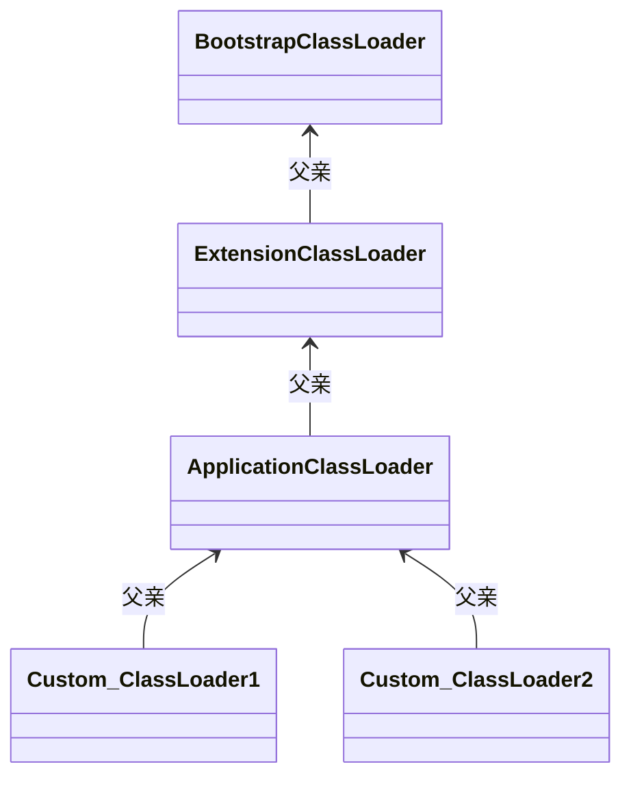

# 类加载器

Java虚拟机设计团队 有意把类加载阶段中的“通过一个类的全限定名来获取描述该类的二进制字节流” 这个动作放到java虚拟机外部去实现，以便让应用程序自己决定如何去获取所需的类。实现这个动作的代码被称为 “**类加载器**”（Class Loader）。


## 类与类加载器

- 类加载器虽然只用于实现类的加载，但它在Java程序中起到的作用却**远超类加载阶段**。
- 对于任意一个类，都必须由加载它的**类加载器**和这个**类本身**一起共同确立其在Java虚拟机中的**唯一性**，**每一个类加载器都拥有一个独立的类名称空间**。
- 比较2个类是否“**相等**”，只有在这两个类是由同一个类加载器加载的前提下才有意义，否则，即使这2个类来源于同一个Class文件，被同一个Java虚拟机加载，只要加载它们的类加载器不同，那这2个类就必定不相等。
- 这里所说的“相等”，包括了类的Class对象的 equals() 、isAssignableFrom()、 isInstance()方法的返回结果，也包括了使用instanceof 关键字做对象所属关系判断等 各种情况。
- 下面代码演示了不同的类加载器对instanceof关键字运算的结果的影响

```java
/**
 * 类加载器与instanceof关键字演示
 *
 * @author zzm
 */
public class ClassLoaderTest {

    public static void main(String[] args) throws Exception {

        ClassLoader myLoader = new ClassLoader() {
            @Override
            public Class<?> loadClass(String name) throws ClassNotFoundException {
                try {
                    String fileName = name.substring(name.lastIndexOf(".") + 1) + ".class";
                    InputStream is = getClass().getResourceAsStream(fileName);
                    if (is == null) {
                        return super.loadClass(name);
                    }
                    byte[] b = new byte[is.available()];
                    is.read(b);
                    return defineClass(name, b, 0, b.length);
                } catch (IOException e) {
                    throw new ClassNotFoundException(name);
                }
            }
        };

        Object obj = myLoader.loadClass("org.fenixsoft.jvm.chapter7.ClassLoaderTest").newInstance();

        System.out.println(obj.getClass());
        System.out.println(obj instanceof org.fenixsoft.jvm.chapter7.ClassLoaderTest);
    }
}


运行结果：
    class org.fenixsoft.jvm.chapter7.ClassLoaderTest
	false
```

- 上面代码构造了一个简单的类加载器，它可以加载与自己在同意路径下的Class 文件，我们使用这个类加载器去加载了一个名为 “ class org.fenixsoft.jvm.chapter7.ClassLoaderTest” 的类，并实例化了这个类的对象。
- todo： 看一下类加载器的源码，如：loadClass（）、defineClass（）等
- 两行输出结果中，从第一行可以看到这个对象确实是类org.fenixsoft.classloading.ClassLoaderTest实例化出来的，但在第二行的输出中却发现这个对象与类org.fenixsoft.classloading.ClassLoaderTest做所属类型检查的时候返回了false。 
-  因为Java虚拟机中同时存在两个 ClassLoaderTest 类，一个是由虚拟机的应用程序类加载器所加载的， 另一个是我们自定义的类加载器加载的，虽然他们都来自于同一个Class文件，但在JVM中仍然是两个互相独立的类，做对象所属类型检查时的结果自然为false。


# 双亲委派模型

站在Java 虚拟机的角度来看，只存在2种不同的类加载器：

-  一种是启动类加载器（Bootstrap ClassLoader），这个类加载器由C++ 语言实现，是虚拟机自身的一部分
- 另一种就是其他所有的类加载器，这些类加载器都有Java语言实现，独立存在虚拟机外部，全部继承自抽象类 java.lang.ClassLoader


站在Java开发人员的角度来看，类加载器应当划分的更细致一些，从JDK1.2以来，Java一直保持 3层类加载器、双亲委派的 类加载架构。

3层类加载器：

### 启动类加载器（Bootstrap ClassLoader）：

- 负责加载存放在%JAVA_HOME%\lib 目录，或者被 -Xbootclasspath 参数所指定的路径存放的，而且是Java虚拟机能够识别的（PS：java虚拟机识别是按照文件名识别的，如rt.jar,  tool.jar ，名字不符合类库即使放在lib目录中也不会被加载）类库加载到虚拟机的内存中。
- 启动类加载器无法被java程序直接引用，用户在编写自定义的ClassLoader 时，如果需要把加载请求委派给  启动类加载器 去处理，直接使用**null** 代替即可

```java
 /**
     * Returns the class loader for the class.  Some implementations may use 
     * null to represent the bootstrap class loader. This method will return
     * null in such implementations if this class was loaded by the bootstrap
     * class loader.
     *
     * <p> If a security manager is present, and the caller's class loader is
     * not null and the caller's class loader is not the same as or an ancestor of
     * the class loader for the class whose class loader is requested, then
     * this method calls the security manager's {@code checkPermission}
     * method with a {@code RuntimePermission("getClassLoader")}
     * permission to ensure it's ok to access the class loader for the class.
     *
     * <p>If this object
     * represents a primitive type or void, null is returned.
     *
     * @return  the class loader that loaded the class or interface
     *          represented by this object.
     * @throws SecurityException
     *    if a security manager exists and its
     *    {@code checkPermission} method denies
     *    access to the class loader for the class.
     * @see java.lang.ClassLoader
     * @see SecurityManager#checkPermission
     * @see java.lang.RuntimePermission
     */
    @CallerSensitive
    public ClassLoader getClassLoader() {
        ClassLoader cl = getClassLoader0();
        if (cl == null)
            return null;
        SecurityManager sm = System.getSecurityManager();
        if (sm != null) {
            ClassLoader.checkClassLoaderPermission(cl, Reflection.getCallerClass());
        }
        return cl;
    }
```

Returns the class loader for the class.  Some implementations may use     **null to represent the bootstrap class loader.** 

This method will **return  null in** such implementations if this class was **loaded by the bootstrap  class loader**.


### 扩展类加载器（Extension Class Loader）

- 这个类加载器时在类 sun.misc.Launcher$ExtClassLoader中以Java代码的形式实现的。

- 它负责加载<JAVA_HOME>\lib\ext目录中，或者被java.ext.dirs系统变量所指定的路径中所有的类库。
- 根据“扩展类加载器”这个名称，就可以推断出这是一种Java系统类库的扩展机制，JDK的开发团队允许用户将具有通用性的类库放置在ext目录里以扩展Java SE的功能，在JDK9之后，这种扩展机制被模块化带来的天然的扩展能力所取代
- 由于扩展类加载器是由 Java代码实现的，开发者可以直接在程序中使用扩展类加载器来加载 Class文件

### 应用程序类加载器（Application Class Loader）

- 这个类加载器由sun.misc.Launcher$AppClassLoader来实现
- 由于应用程序类加载器是ClassLoader类中的getSystem- ClassLoader()方法的返回值，所以有些场合中也称它为“系统类加载器”。
- 它负责加载用户类路径（ClassPath）上所有的类库，开发者同样可以直接在代码中使用这个类加载器
- 如果应用程序中没有自定义过自己的类加载器，一般情况下这个就是程序中默认的类加载器。


### 类加载器双亲委派模型

**图7-2　类加载器双亲委派模型**




- 图7-2中展示的各种类加载器之间的层次关系被称为类加载器的“双亲委派模型（Parents DelegationModel）”。

- 双亲委派模型要求除了顶层的启动类加载器外，其余的类加载器都应有自己的父类加载器。
- 不过这里类加载器之间的父子关系一般不是以继承（Inheritance）的关系来实现的，而是通常使用组合（Composition）关系来复用父加载器的代码。
- 类加载器的双亲委派模型在JDK 1.2时期被引入，并被广泛应用于此后几乎所有的Java程序中，但它并不是一个具有强制性约束力的模型，而是Java设计者们推荐给开发者的一种类加载器实现的最佳实践。

#### 双亲委派工作过程

- 如果一个ClassLoader 收到了 类加载的请求，
- 它首先不会自己去尝试加载这个类，而是把这个请求委派给 **父类加载器** 去完成，每一个层次的类加载器都是如此，
- 因此所有的加载请求最终都应该送到最顶层的启动类加载器中，
- 只有当 父类加载器 反馈自己无法完成这个加载请求（它的搜索范围中没有找到所需的类）时，子类加载器才会尝试自己去完成加载。

#### 优点:

- Java中类随着它的类加载器一起具有了一种带有优先级的层次关系。
- 例如：类java.lang.Object ，它存放在rt.jar 中，无论哪一个类加载要加载这个类，最终都是委派给处于模型最顶端的启动类加载器进行加载， 因此Object类在程序的各种类加载器 环境中都能保证时同一个类。
- 反之 如果没有使用双亲委派模型，都有各个类加载器自行去加载的话，如果用户自己也编写了一个名为 java.lang.Object的类，并放在程序的ClassPath中，那系统中就会出现 多个不同的Object类，Java类型体系中最基础的行为也就无从保证。

#### 源码

```java

    protected Class<?> loadClass(String name, boolean resolve)
        throws ClassNotFoundException
    {
        synchronized (getClassLoadingLock(name)) {
            // First, check if the class has already been loaded
            //首先，检查请求的类是否已经被加载过了
            Class<?> c = findLoadedClass(name);
            if (c == null) {
                long t0 = System.nanoTime();
                try {
                    if (parent != null) {
                        c = parent.loadClass(name, false);
                    } else {
                        c = findBootstrapClassOrNull(name);
                    }
                } catch (ClassNotFoundException e) {
                    // ClassNotFoundException thrown if class not found
                    // from the non-null parent class loader
                    // 如果父类加载器抛出ClassNotFoundException
					// 说明父类加载器无法完成加载请求
                }

                if (c == null) {
                    // If still not found, then invoke findClass in order
                    // to find the class.
                    // 在父类加载器无法加载时
					// 再调用本身的findClass方法来进行类加载
                    long t1 = System.nanoTime();
                    c = findClass(name);

                    // this is the defining class loader; record the stats
                    sun.misc.PerfCounter.getParentDelegationTime().addTime(t1 - t0);
                    sun.misc.PerfCounter.getFindClassTime().addElapsedTimeFrom(t1);
                    sun.misc.PerfCounter.getFindClasses().increment();
                }
            }
            if (resolve) {
                resolveClass(c);
            }
            return c;
        }
    }
```

这段代码的逻辑清晰易懂：

- 先检查请求加载的类型是否已经被加载过，

  - 若没有则调用父加载器的loadClass()方法，

  - 若父加载器为空则默认使用启动类加载器作为父加载器。

- 假如父类加载器加载失败，抛出ClassNotFoundException异常的话，才调用自己的findClass()方法尝试进行加载。


## 破坏双亲委派模型

双亲委派模型并不是一个具有强制性约束的模型，而是Java设计者推荐给开发者们的类加载器实现方式。

在Java的世界中大部分的类加载器都遵循这个模型，但也有例外的情况，直到Java模块化出现为止，双亲委派模型主要出现过3次较大规模“被破坏”的情况。

### 第一次破坏双亲委派

- 第一次 “被破坏”其实发生在**双亲委派模型出现之前**——即JDK 1.2面世以前的“远古”时代。
- 由于双亲委派模型在JDK 1.2之后才被引入，但是类加载器的概念和抽象类java.lang.ClassLoader则在Java的第一个版本中就已经存在，面对已经存在的用户自定义类加载器的代码，Java设计者们引入双亲委派模型时不得不做出一些妥协，为了**兼容这些已有代码**，无法再以技术手段避免loadClass()被子类覆盖的可能性，只能在JDK 1.2之后的java.lang.ClassLoader中添加一个**新的protected方法findClass()**，并**引导用户编写的类加载逻辑时尽可能去重写这个方法**，而不是在loadClass()中编写代码。
- 我们已经分析过loadClass()方法，双亲委派的具体逻辑就实现在这里面，按照loadClass()方法的逻辑，如果父类加载失败，会自动调用自己的findClass()方法来完成加载，这样既不影响用户按照自己的意愿去加载类，又可以保证新写出来的类加载器是符合双亲委派规则的。

### 第二次破坏双亲委派

- 第二次“被破坏”是由这个模型自身的缺陷导致的，
- 双亲委派很好地解决了各个类加载器协作时基础类型的一致性问题（越基础的类由越上层的加载器进行加载），基础类型之所以被称为“基础”，是因为它们总是作为被用户代码继承、调用的API存在，
- 但程序设计往往没有绝对不变的完美规则，如果有基础类型又要调用回用户的代码，那该怎么办呢？
- 一个典型的例子便是JNDI服务，JNDI现在已经是Java的标准服务，它的代码由启动类加载器来完成加载（在JDK 1.3时加入到rt.jar的），肯定属于Java中很基础的类型了。但JNDI存在的目的就是对资源进行查找和集中管理，它需要调用由其他厂商实现并部署在应用程序的ClassPath下的JNDI服务提供者接口（Service Provider Interface，SPI）的代码，现在问题来了，启动类加载器是绝不可能认识、加载这些代码的，那该怎么办？
- 为了解决这个困境，Java的设计团队只好引入了一个不太优雅的设计：线程上下文类加载器（Thread Context ClassLoader）。这个类加载器可以通过java.lang.Thread类的setContext-ClassLoader()方法进行设置，如果创建线程时还未设置，它将会从父线程中继承一个，如果在应用程序的全局范围内
  都没有设置过的话，那这个类加载器默认就是应用程序类加载器。
- 有了线程上下文类加载器，程序就可以做一些“舞弊”的事情了。JNDI服务使用这个线程上下文类加载器去加载所需的SPI服务代码，这是一种**父类加载器去请求子类加载器完成类加载**的行为，这种行为实际上是打通了双亲委派模型的层次结构来**逆向使用类加载器**，已经**违背了双亲委派模型的一般性原则**，但也是无可奈何的事情。Java中涉及SPI的加载基本上都采用这种方式来完成，例如JNDI、JDBC、JCE、JAXB和JBI等。不过，当SPI的服务提供者多于一个的时候，代码就只能根据具体提供者的类型来硬编码判断，为了消除这种极不优雅的实现方式，在JDK 6时，JDK提供了**java.util.ServiceLoader类**，以**META-INF/services**中的配置信息，**辅以责任链模式**，这才算是给SPI的加载提供了一种相对合理的解决方案。

### 第三次破坏双亲委派

- 第三次“被破坏”是由于用户对程序动态性的追求而导致的，这里所说的“动态性”指的是一些非常“热”门的名词：**代码热替换**（**Hot Swap**）、**模块热部署**（**Hot Deployment**）等。
- 说白了就是希望Java应用程序能像我们的电脑外设那样，接上鼠标、U盘，不用重启机器就能立即使用，鼠标有问题或要升级就换个鼠标，不用关机也不用重启。对于个人电脑来说，重启一次其实没有什么大不了的，但对于一些生产系统来说，关机重启一次可能就要被列为生产事故，这种情况下热部署就对软件开发者，尤其是大型系统或企业级软件开发者具有很大的吸引力。

### OSGi实现热部署原理

OSGi实现模块化热部署的关键是它**自定义的类加载器机制**的实现，每一个程序模块（OSGi中称为Bundle）都有一个自己的类加载器，当需要更换一个Bundle时，就把**Bundle连同类加载器一起换掉**以实现代码的热替换。

在OSGi环境下，类加载器不再是双亲委派模型推荐的树状结构，而是进一步发展为更加复杂的**网状结构**，当收到类加载请求时，OSGi将按照下面的顺序进行类搜索：

1. 将以java.*开头的类，委派给父类加载器加载。
2. 否则，将委派列表名单内的类，委派给父类加载器加载。
3. 否则，将Import列表中的类，委派给Export这个类的Bundle的类加载器加载。
4. 否则，查找当前Bundle的ClassPath，使用自己的类加载器加载。
5. 否则，查找类是否在自己的Fragment Bundle中，如果在，则委派给Fragment Bundle的类加载器加载。
6. 否则，查找Dynamic Import列表的Bundle，委派给对应Bundle的类加载器加载。
7. 否则，类查找失败。

上面的查找顺序中只有**开头两点仍然符合双亲委派模型**的原则，其余的类查找都是在**平级的类加载器**中进行的。


虽然使用了“被破坏”这个词来形容上述不符合双亲委派模型原则的行为，但这里“被破坏”并不一定是带有贬义的。

**只要有明确的目的和充分的理由，突破旧有原则无疑是一种创新**。

OSGi中对类加载器的运用是值得学习的，完全弄懂了OSGi的实现，就算是掌握了类加载器的精粹

