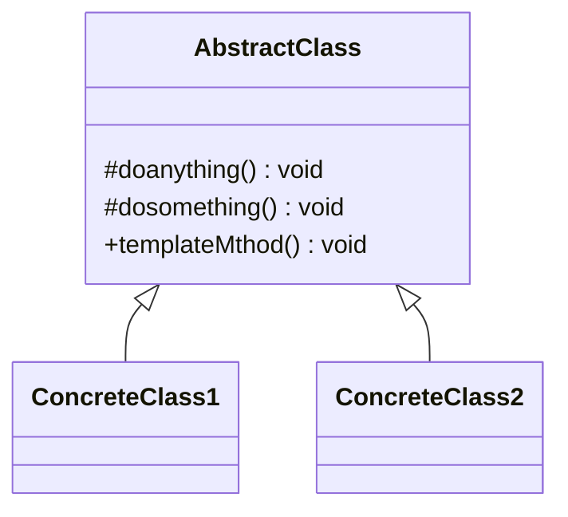

 ## 模板方法模式(Template Method Pattern)
 ### 定义：

 Define the skeleton of an algorithm in an operation, deferring some steps to subclasses.

Template Method lets subclasses redefine certain steps of an algotithm without changing the algorithm's structure

(定义一个操作中的算法的框架，而将一些步骤延迟到子类中。使得子类可以不改变一个算法的结构 就可以重新定义算发的某些特定步骤)




模板方法非常简单，仅仅使用了java的继承机制，但是应用非常广泛的模式

#### AbstractClass 抽象模板

它的方法分为2类：

- 基本方法（基本操作）: 由子类实现的方法，并在模板方法中被调用

- 模板方法： 可以由一个或几个，一般是一个具体方法，也就是一个框架

  ps: 注意： 为了防止恶意操作，一般模板方法上都加上一个final关键字，不允许被覆写

  

  #### 具体模板

ConcreteClass1 和 ConcreteClass2 属于具体模板 ，实现父类所定义的一个或者多个抽象方法，

也就是父类定义的基本方法在子类中得以实现


```java
public abstract class AbstractClass {
    //基本方法
    protected abstract void doSomething();
    //基本方法
    protected abstract void doAnything();
    //模板方法
    public void templateMethod(){
        /*
        * 调用基本方法，完成相关的逻辑
        */
        this.doAnything();
        this.doSomething();
    }
}

//代码清单10-7 具体模板类
public class ConcreteClass1 extends AbstractClass {
    //实现基本方法
    protected void doAnything() {
    //业务逻辑处理
    }
    protected void doSomething() {
    //业务逻辑处理
    }
}
public class ConcreteClass2 extends AbstractClass {
    //实现基本方法
    protected void doAnything() {
    //业务逻辑处理
    }
    protected void doSomething() {
    //业务逻辑处理
    }
}

```


注意： 抽象模板中的基本方法尽量设计为 protected类型，符合迪米特法则，不需要暴露的属性和方法尽量不要设置为protected类型。

实现类若非必要，尽量不要扩大父类中的访问权限 

## 模板方法模式的应用

### 优点

- 封装不变的部分，扩展可变的部分 

不变的部分封装在父类中实现，可变的部分则可以通过继承来继续扩展。

非常容易扩展，增加一个子类，实现父类的基本方法就可以

- 提取公共的部分代码，便于维护

  如果不抽取公共的代码，那当需要修改一个逻辑的时候，就需要到处查找类似的代码

- 行为由父类控制，子类实现

  基本方法是子类实现的，因此子类可以通过扩展的方式增加相应的功能，符合开闭原则

### 缺点

设计习惯一般是 ： 抽象类负责声明最抽象、最一般的事物属性和方法，实现类完成具体的事物属性和方法。

但是模板方法模式却颠倒了，抽象类定义了部分抽象方法，由子类实现，子类执行的结果影响了父类的结果。

也就是子类对父类产生了影响。

导致了在复杂的项目中，增加了代码的阅读的难度，让人感到不适

### 使用场景

- 多个子类由公有的方法，并且逻辑基本相同时
- 重要的复杂的算法，可以把核心算法设计为 Template method，周边的相关细节功能，则由各个子类实现
- 重构时，把相同的代码抽取到父类中，然后通过钩子函数 约束其行为

### 扩展

增加钩子函数


在抽象类中，isAlarm 是一个实现方法，其作用是模板方法 根据其返回值决定是否要 响 喇叭，子类可以覆写该返回值。

 

isAlarm  的返回值影响了模板方法的执行结果，这就是 钩子方法（Hook Method）。有了钩子方法 模板方法模式才算完美，


- 模板方法模式就是在模板方法中按照一定的规则和顺序调用基本方法，具体到前面的例子，就是run 方法按照 规定的顺序

  调用 本类的基本方法，并且由 isAlarm（钩子函数）的返回直接确定run方法中的执行顺序的变更。

### 最佳实践

新手总是问老手： 父类怎么调用子类的方法。父类能调用子类的方法，但是强烈、极度不建议这么做。应该：

- 把子类传递到父类的有参构造函数中，然后调用
- 使用反射的方式调用，
- 父类调用子类的静态方法

以上三种都是父类直接调用子类的方法。不建议


父类建立框架，子类重写了父类的部分方法后，再调用从父类继承的方法，产生不同的结果（这就是Template Method Pattern）。

这是不是可以理解为父类调用了子类的方法。你修改了子类，影响了父类行为的结果，曲线救国的方式 实现了父类依赖子类的场景 。

模板方法模式就是这种效果


模板方法在一些开源框架中应用非常多，它提供了一个抽象类，然后开源框架写了一堆的子类。《** in action》中就说明了，

如果你需要扩展功能，可以继承这个抽象类，然后覆写 Protected 方法，然后就是 调用了一个类似 execute方法，就完成你的扩展开发，

非常容易扩展的一种模式

 

### todo 去找到这种开源框架的例子

