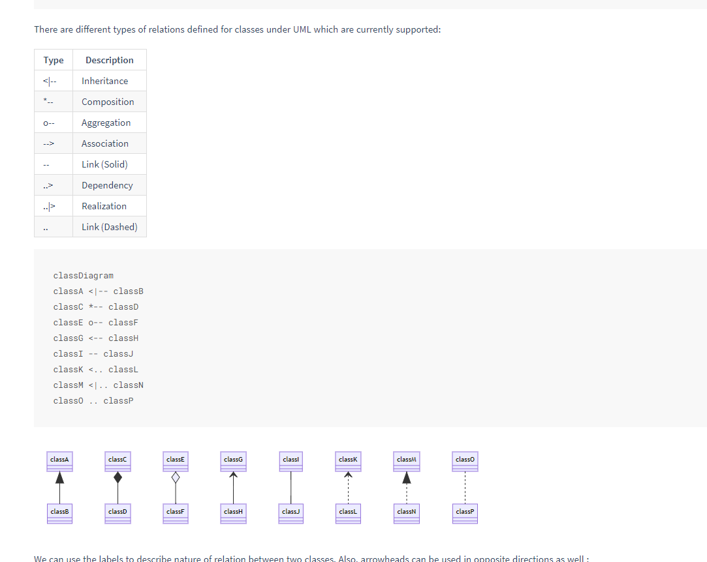
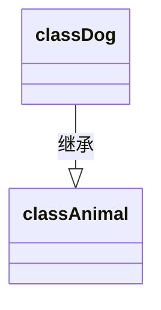
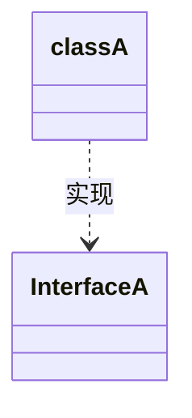
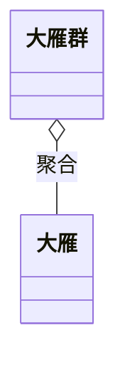
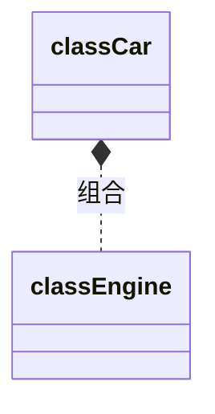

# 设计模式之禅-类图

最近一段时间，又看了一遍设计模式，发现和以前有了不一样的理解。
以前看设计模式感觉更像是死记硬背，没有掌握方法，只是觉得这个很重要，可是不是很理解。

但是 其实学习设计模式，

**前提**一定是要先会看和画 **类图**，这也是一门语言，很直观的可以看出各个类之间的关系，然后再去想为什么这么设计



ps: 使用  [ mermaid ](https://mermaid-js.github.io/mermaid/#/classDiagram)  画类图

## 常见的类图关系：

### 泛化（Generalization）：

泛化包含继承（Inheritance）和实现（Realization）

#### 继承（Inheritance）：

在UML类图中，继承通常使用 **空心三角+实线** 表示





#### 实现（Realization）：

在UML类图中，实现通常使用`空心三角+虚线`表示




### 依赖（Dependence）：

- 简单理解就是一个类A 使用到类B，这种关系很弱，关系临时且偶然

- 依赖关系在Java语言中体现为`成员变量、局域变量、方法的形参、方法返回值`，或者对静态方法的调用。

- 在代码层面就是类B 作为参数在类A 的某个方法中使用

- 在UML类图中，依赖通常使用`虚线箭头`表示

  
  
  ```mermaid
  classDiagram
  classA ..> classB :依赖
  ```
### 关联（Association）:

- 强依赖关系，类似与朋友关系，是平等的

- 关联是单向或者双向的，可以是1：1，或者1：N

- 关联关系以实线箭头表示

- 表现在代码层面就是被关联对象B 以 类属性的形式 出现在类A 中， 或者List<B>出现在 类A中  

  

  

  

  ```mermaid
  classDiagram
  classA --> classB : 关联
  ```

  

### 聚合（Aggregation）：


- 集体和个体的关系（雁群和大雁）
- has a的关系，如List<A> 和A的关系

- 聚合关系表示整体和个体的关系，整体和个体可以相互独立存在，一定是有两个模块分别管理整体和个体。
- 在UML类图中，聚合通常使用`空心菱形+实线箭头`表示




### 组合（Composition）：

- 组合关系是`关联关系的一种特例`，他体现的是一种`contains-a`(包含)的关系，这种关系比聚合更强，也称为强聚合。它要求普通的聚合关系中代表整体的对象负责代表部分对象的生命周期，组合关系是不能共享的 
- 大雁和 翅膀的关系，汽车和 发动机的关系，拥有同一个生命周期
- 整体和个体不能独立存在，一定是在一个模块中同时管理整体和个体，生命周期必须相同(级联)。
- 在UML类图中，组合通常使用`实心菱形+实线箭头`表示
- 体现在代码层面就是 B是A的构造函数 的参数





## 总结：

当我们了解了这些基础的关系后，后面参考类图看设计模式，心里就会有一个大的思路，这个时候就只需要去想 ，这么设计的好处是什么就可以了